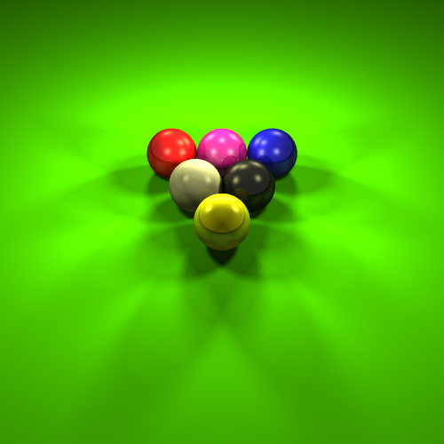
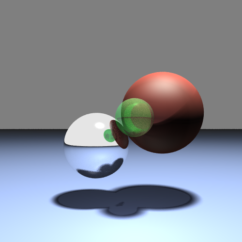
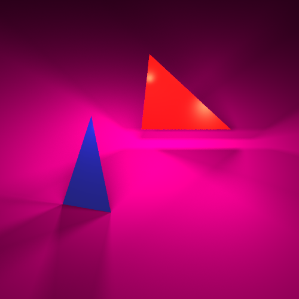

# Ray Tracing Program
The program was built as an assignment for Computer Graphics course (TAU).

## Main purpose 
The program's purpose is to render an image from a 3d model which describes objects in the 3d space. This program uses a technique called ray tracing. The technique is capable of producing a high degree of visual realism, but in some cases it requires a relatively high computational cost. More information about ray tracing can be found [Here](https://en.wikipedia.org/wiki/Ray_tracing_(graphics)).

## What does it look like?
Below are some of the program outputs:

  
  
  

## Algorithm overview
Optical ray tracing describes a method for producing visual images constructed in 3D computer graphics environments. It works by tracing a path from an imaginary eye through each pixel in a virtual screen, and calculating the color of the object visible through it.

Scenes in ray tracing are described mathematically by an input file which is processed by the program. Typically, each ray must be tested for intersection with some subset of all the objects in the scene. Once the nearest object has been identified, the algorithm will estimate the incoming light at the point of intersection, examine the material properties of the object, and combine this information to calculate the final color of the pixel. In our case, we use Phong illumination model in order to calculate the way the light affects each fixel in the scene. The program also takes reflective and transparent materials into account.

It may at first seem counterintuitive or "backwards" to send rays away from the camera, rather than into it (as actual light does in reality), but doing so is many orders of magnitude more efficient. Since the majority of light rays from a given light source do not make it directly into the viewer's eye, a "forward" simulation could potentially waste a major amount of computation on light paths that are never recorded.

After either a maximum number of reflections or a ray traveling a certain distance without intersection, the ray ceases to travel and the pixel's value is updated. The view plane of the camera and the pixels on it are actually represented by the output image of the program.

## Input files
The program's input files describe the technique's model. An input file includes the following parameters:
* Camera parameters: absolute location, up vector, viewing vector.
* General scene settings: default background color, recursion length for rays that hit sufaces several times, supersampling parameters, number of "shadow rays" for the soft shadows feature.
* Material types in the scene: color, illumination parameters (diffuse and specular color), reflectivity and transparency parameters.
* Object instances: type (plane, sphere or a triangle), location, material type.
* Point light instances: location, direction, color, specularity and shadow parameters.

An example input file can be found [Here](https://github.com/itay99988/RayTracing/blob/master/example_inputs/input1.txt).
The input file in inserted as a command line argument.

## Scene objects types
We implement a few types of objects that the program can deal with: 
* A sphere (3d)
* A plane (2d)
* A triangle (2d)

## Illumination model overview
We used the Phong illumonation and shading model in order to light the scene:
* Diffuse color (RGB). This is the "regular" color of a surface. This value is multiplied by the light received by the object to find the base color of the object.
* Specular color (RGB). Specularity is the color the material gets from the reflection of a light source. The specular color of a surface defines the intensity and color of that reflection. Materials in real life often have different specular color than diffuse color. For example, a polished wooden desk would have a brown diffuse color but white specular color.
* Phong specularity coefficient (floating point number). We will use the Phong shading model. This coefficient controls the type of specularity of a surface. A high value (around 100) renders small and sharp specular reflections, for shiny surfaces such as metal, and a low value (around 1 or so) renders wide and soft specular reflections, for materials such as clay or stone.

## Special features

## Scene Definition Format
This is a more detailed description of the input text file. The scenes are defined in text scene files with the following format. Every line in the file defines a single object in the scene, and starts with a 3 letter code that identifies the object type. After the 3 letter code a list of numeric parameters is given.
The possible objects with their code and list of required parameters are given below.
* "cam" = camera settings (there will be only one per scene file) params[0,1,2] = position (x, y, z) of the camera params[3,4,5] = look-at position (x, y, z) of the camera params[6,7,8] = up vector (x, y, z) of the camera params[9] = screen distance from camera
params[10] = screen width from camera
* "set" = general settings for the scene (once per scene file) params[0,1,2] = background color (r, g, b)
params[3] = root number of shadow rays (N^2 rays will be shot) params[4] = maximum number of recursions
params[5] = super sampling level.
* "mtl" = defines a new material
params[0,1,2] = diffuse color (r, g, b) params[3,4,5] = specular color (r, g, b) params[6,7,8] = reflection color (r, g, b)
params[9] = phong specularity coefficient (shininess) params[10] = transparency value between 0 and 1 params[11] = incidence
if the feature is not implemented, the value is ignored
* "sph" = defines a new sphere
params[0,1,2] = position of the sphere center (x, y, z) params[3] = radius
params[4] = material index (integer). each defined material gets an automatic material index starting from 1, 2 and so on
* "pln" = defines a new plane params[0,1,2] = normal (x, y, z) params[3] = offset
params[4] = material index
* "trg" = defines a new triangle
Params[0,1,2]=position of vertex 1
Params[3,4,5]=position of vertex 2
Params[6,7,8]=position of vertex 3
params[9] = material index
* "lgt" = defines a new light
params[0,1,2] = position of the light (x, y, z) params[3,4,5] = light color (r, g, b) params[6] = specular intensity
params[7] = shadow intensity
params[8] = light width / radius (used for soft shadows)

## Credits
